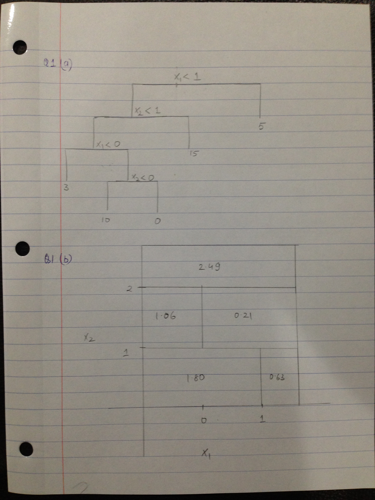

# Q1

  

# Q2
- Booststrap estimates for P(Class is Red | X)={ 0.1, 0.15, 0.2, 0.2, 0.55,0.6, 0.6, 0.65, 0.7, 0.75}

- Majority Approach:  X=Red
  - Number of times P(Class is Red | X)>0.5. In this case 6 times P(Class is Red |  X)>0.5 hence X=Red

- Average Approach: X=Green
  - Take average of the probability values. i.e P(Class is Red|
  X)=0.45. Hence P(Class is Green|X)=0.55. X=Green

# Q3
  + 3a.
  
    ```{r}
    library(tree)
    library(ISLR)
    attach(Carseats)
    set.seed(1)
    train=sample(1:nrow(Carseats),200)
    Carseats.train=Carseats[train,]
    Carseats.test=Carseats[-train,]
    ```
    
  + 3b.
  
    ```{r}
    tree.carseats=tree(Sales~.,Carseats,subset=train)
    summary(tree.carseats)

    par(mfrow=c(1,1))
    
    tree.pred=predict(tree.carseats,Carseats.test)
    mean((tree.pred-Carseats.test$Sales)^2)
    ```

    ```{r}
    
      plot(tree.carseats)  
      text(tree.carseats)
      
    ```
 
   - Variables that were included in the construction of the tree were: ShelveLoc, Price, Age, Advertising, Income and Comp Price. There are 18 terminal nodes or leaves. The RSS for the training data is 2.36
  
    - The key variable is ShelveLoc which is split into 2 parts Bad and Medium. ShelfLoc = Good is not a critical indicator of sale price.  Price is another key varible which is combined when with ShelveLoc=Bad to give to give split at 120.5 and combined with ShelvLoc=Medium to give a split at price=113. Best Sales number seems to be when the ShelveLoc is a Medium and the sale price is 113.
  
  
   - the test MSE is 4.15
  
  + 3c.
    
    ```{r}
   
      cv.carseats=cv.tree(tree.carseats)
      plot(cv.carseats$size,cv.carseats$dev, type='b')
      prune.carseats=prune.tree(tree.carseats,best=9)
      plot(prune.carseats)
      text(prune.carseats, pretty=0)
      yhat=predict(prune.carseats, newdata=Carseats.test)
      plot(yhat, Carseats.test$Sales, xlab="Predicted Sales Values", ylab="Actual Sales Values")
      abline(0,1)
      mean((yhat-Carseats.test$Sales)^2)
      
    ```
  
  - Pruning the tree does not reduce the test MSE. Infact the test MSE increases to 4.99
  
  + 3d.
    
    ```{r}
    library(randomForest)
    set.seed(1)
    bag.carseats=randomForest(Sales~.,data=Carseats,subset=train,mtry=10,importance=T)
    
    yhat.bag=predict(bag.carseats,newdata=Carseats.test)
    plot(yhat.bag, Carseats.test$Sales)
    abline(0,1)
    mean((yhat.bag-Carseats.test$Sales)^2)
    varImpPlot(bag.carseats)

    ```
  
    - Test MSE after doing bagging is 2.55
    - Price and ShelveLoc are the two most important variables for determining amount of Sales
  
  + 3e.
    
    ```{r}
    set.seed(1)
    rf.carseats=randomForest(Sales~.,data=Carseats,subset=train,importance=T)
    yhat.rf=predict(rf.carseats,newdata=Carseats.test)
    plot(yhat.rf, Carseats.test$Sales)
    abline(0,1)
    mean((yhat.rf-Carseats.test$Sales)^2)
    varImpPlot(rf.carseats)
    ```
  
     - Test MSE after doing bagging is 3.3 which is higher than bagging but lower than regression tree
     - Price and ShelveLoc are the two most important variables for determining amount of Sales
     - We used the default 'm' for random forest that is $sqrt(p)$ i.e = 3 variables. Just using 3 variables increased the Test MSE compared to Bagging which used 10 variables.
  

  
# Q4
  + 4a.
    
    ```{r}
    library(ISLR)
    fix(Hitters)
    Hitters=na.omit(Hitters)
    Hitter=na.omit(Hitters)
    Hitter$Salary=log(Hitters$Salary)
    ```
  
  + 4b.
    
    ```{r}
    train=1:200
    test=-train
    Hitter.train=Hitter[train,]
    Hitter.test=Hitter[-train,]
    ```
  
  + 4c.
    
    ```{r}
    library(gbm)
    set.seed(1)
    
    train.mse=matrix(data=NA, nrow=100, ncol=2)
    test.mse=matrix(data=NA, nrow=100, ncol=2)
    for(i in 1:100){
      lambda=i*0.01
      train.mse[i,1]=lambda
      test.mse[i,1]=lambda
      
      boost.hitter=gbm(Salary~.,data=Hitter.train, distribution="gaussian", n.trees=1000,interaction.depth=4,shrinkage = lambda)
      train.mse[i,2]=mean(boost.hitter$train.error)
      
    yhat.boost=predict(boost.hitter,newdata=Hitter.test,n.trees=1000)
    test.mse[i,2]=mean((yhat.boost-Hitter.test$Salary)^2)
    }
    
    plot(train.mse[,1],train.mse[,2], xlab="Shrinkage factor", ylab="Training MSE")
    
    ```
  
  + 4d.
    
    ```{r}
    plot(test.mse[,1],test.mse[,2], xlab="Shrinkage factor", ylab="Test MSE")
    ```
  
  + 4e.
    
    ```{r}
    lm.fit=lm(Salary~.,data=Hitter.train)
    lm.pred=predict(lm.fit,Hitter.test)
    mean((lm.pred-Hitter.test$Salary)^2)
    
    library(glmnet)
    set.seed(1)
    x=model.matrix(Salary~.,Hitter)
    y=Hitter$Salary
    y.test=y[test]
    grid=10^seq(10,-2,length=100)
    ridge.mod=glmnet(x[train,],y[train],alpha=0, lambda=grid, thresh=1e-12)
    ridge.pred=predict(ridge.mod,s=212,newx=x[test,])
    mean((ridge.pred-y.test)^2)
    
    ```
  
    - Minimum Test MSE: Boosting: 0.249
    - Minimum Test MSE: Linear Model fit: 0.49
    - Minimum Test MSE: Ridge Regression: 0.45
    
  + 4f.
    
    ```{r}
     boost.hitter=gbm(Salary~.,data=Hitter.train, distribution="gaussian", n.trees=1000,interaction.depth=4,shrinkage =0.12)
      summary(boost.hitter)
    ```
  
    - CAtBat and CRuns are the key variables.

  + 4g.
  
    ```{r}
      
    library(randomForest)
    set.seed(1)
    bag.Hitter=randomForest(Salary~.,data=Hitter.train,mtry=19,importance=T)
    yhat.bag=predict(bag.Hitter,newdata=Hitter.test)
    plot(yhat.bag, Hitter.test$Salary)
    abline(0,1)
    mean((yhat.bag-Hitter.test$Salary)^2)
    ```
  
    - Test MSE using Bagging: 0.23
  
# Q5

    ```{r}
    
    library(kernlab)
    library(e1071)
    set.seed(1)
    x=matrix(rnorm(100*2),ncol=2)
    x[1:25,]=x[1:25,]+2
    x[26:50,]=x[26:50,]-2
    
    y=c(rep(1,60),rep(2,40))
    df=data.frame(x=x, y=as.factor(y))
    
    plot(x,col=y)
    
    train=sample(100,75)
    test=-train
    
    df.train=df[train,]
    df.test=df[test,]
    
    svmfit=svm(y~.,data=df[train,],kernel="radial", gamma=1,cost=1,scale=F)
    plot(svmfit,df[train,])
    summary(svmfit)
    
    ytrain=predict(svmfit, df[train,])
    table(predict=ytrain, truth=df[train,"y"])
    
    
    ytest=predict(svmfit, df[test,])
    table(predict=ytest, truth=df[test,"y"])
    
    #Linear filter
    svmfit=svm(y~.,data=df[train,],kernel="linear", cost=0.1,scale=F)
    plot(svmfit,df[train,])
    summary(svmfit)
    
    
    ytrain=predict(svmfit, df[train,])
    table(predict=ytrain, truth=df[train,"y"])
    
    
    ytest=predict(svmfit, df[test,])
    table(predict=ytest, truth=df[test,"y"])
    ```

  - With the Radial Kernel, 65 out 75 points have been assigned the correct class in the training data and 21 out of 25 points have been assigned the correct class in the test data.
  - With the Linear kernel, only 46 out of 75 points are correctly assigned the correct class in training data and 14 out of 25 points have been assigned the correct class in the test data.

# Q6

  - 6a.
  
    ```{r}
    library(ISLR)
    median(Auto$mpg)
    mileage=ifelse(Auto$mpg>=median(Auto$mpg),1,0)
    ```
  
  - 6b.
    
    ```{r}
        df=data.frame(cylinder=Auto$cylinders,displacement= Auto$displacement, horsepower= Auto$horsepower,  weight=Auto$weight, acceleration=Auto$acceleration, year=Auto$year, origin=Auto$origin, name=Auto$name,mileage=as.factor(mileage))
    
    set.seed(1)
    tune.out=tune(svm,mileage~.,data=df, kernel="linear",ranges=list(cost=c(0.001,0.01,0.1,1,5,10,100)))
    summary(tune.out)
    bestmod=tune.out$best.model
    summary(bestmod)
    
    ```
  
    - Best results are obtained with Cost=1 and the error rate is 0.092
  
  - 6c.
    
    ```{r}
        
    set.seed(1)
    tune.out=tune(svm,mileage~.,data=df, kernel="radial",ranges=list(cost=c(0.001,0.01,0.1,1,5,10,100),gamma=c(0.5,1,2,3,4)))
    summary(tune.out)
    bestmod=tune.out$best.model
    summary(bestmod)
    
    #polynomial
    set.seed(1)
    tune.out=tune(svm,mileage~.,data=df, kernel="polynomial",ranges=list(cost=c(0.001,0.01,0.1,1,5,10,100),gamma=c(0.5,1,2,3,4)))
    summary(tune.out)
    bestmod=tune.out$best.model
    summary(bestmod)
    ```
  
   - For Radial Kernel Best results are obtained with Cost=1 and Gamma=1. The error rate is 0.07647 that is better than linear kernel
   - For Polynomial Kernel, best results are obtianed with Cost=1, Gamma=0.5 and a Degree-3 polynomial. The error here is 0.07634 that is lower than linear kernel and bit lower than radial kernel error

# Q7
